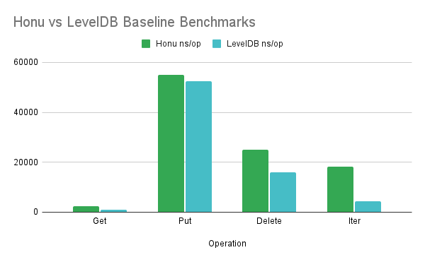

# Honu

[](https://pkg.go.dev/github.com/rotationalio/honu)
[](https://goreportcard.com/report/github.com/rotationalio/honu)


**HonuDB is a replicated key-value store intended for large systems that are distributed globally. Although HonuDB uses an eventually consistent gossip protocol for replication, it uses reinforcement learning with multi-armed bandits to optimize replication. Adaptive consistency reduces costs (ingress and egress data transfer) as well as improves consistency by lowering the likelihood of stale reads or forked writes.**

## Benchmarks

Baseline comparison of honu database vs. pure leveldb performance to determine the overhead that honu adds:

```
BenchmarkHonuGet-8         	  466665	      2405 ns/op
BenchmarkLevelDBGet-8      	 1243785	       955.3 ns/op
BenchmarkHonuPut-8         	   21448	     55125 ns/op
BenchmarkLevelDBPut-8      	   24276	     52422 ns/op
BenchmarkHonuDelete-8      	   42298	     25136 ns/op
BenchmarkLevelDBDelete-8   	   76857	     16101 ns/op
BenchmarkHonuIter-8        	   63772	     18349 ns/op
BenchmarkLevelDBIter-8     	  255319	      4271 ns/op
BenchmarkHonuObject-8      	  480555	      2362 ns/op
```

[](docs/benchmark.png)