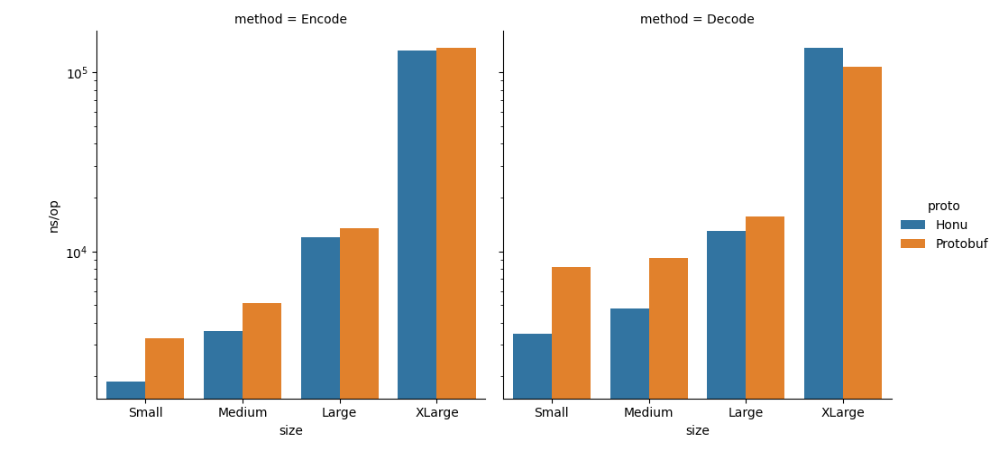

# Honu

[](https://goreportcard.com/report/github.com/rotationalio/honu)


The Honu Database is an eventually consistent replicated document database that intended for large systems that are distributed globally. Honu uses smart anti-entropy replication to quickly replicate collections across multiple nodes.

Smart anti-entropy uses reinforcement learning with multi-armed bandits to optimize replication. Adaptive consistency reduces costs (ingress and egress data transfer) as well as improves consistency by lowering the likelihood of stale reads or forked writes.

The goal of the database is to provide scalable data retrieval both in terms of number of nodes (e.g. scale to 100s of nodes) and amount of data (hundreds of terabytes). In addition to scale, this database provides data access controls, privacy and provenance, and other security related features. In short, HonuDB is a distributed data governance database for machine learning and artificial intelligence workloads.


## Object Storage

Protocol Buffers are a compact, cross-language compatible data serialization format that facilitates compact network communications. However, in order to make them general purpose and flexible, they require a lot of reflection to work in Go. Since a database is a high performance application, I've implemented a data serialization format that uses no reflection and as a result performs far better at decoding than Protocol Buffers:

```
goos: darwin
goarch: arm64
pkg: github.com/rotationalio/honu/pkg/store
cpu: Apple M1 Max
BenchmarkSerialization/Small/Encode/Honu-10         	  653840	      1905 ns/op	      1471 bytes	    4319 B/op	       2 allocs/op
BenchmarkSerialization/Small/Encode/Protobuf-10     	  346150	      3164 ns/op	      2426 bytes	    4044 B/op	       1 allocs/op
BenchmarkSerialization/Small/Decode/Honu-10         	  343032	      3421 ns/op	    4784 B/op	      62 allocs/op
BenchmarkSerialization/Small/Decode/Protobuf-10     	  161241	      7889 ns/op	    8367 B/op	     127 allocs/op
```



## Documentation

The docs are set up using the [Cinder](https://sourcefoundry.org/cinder/) MkDocs theme, ported (somewhat) into Hugo using the [Cinder GitHub repository](https://github.com/chrissimpkins/cinder). A lot of work still needs to be done to get these docs ready for prime time, but it serves as a quick placeholder while we're working on the database.